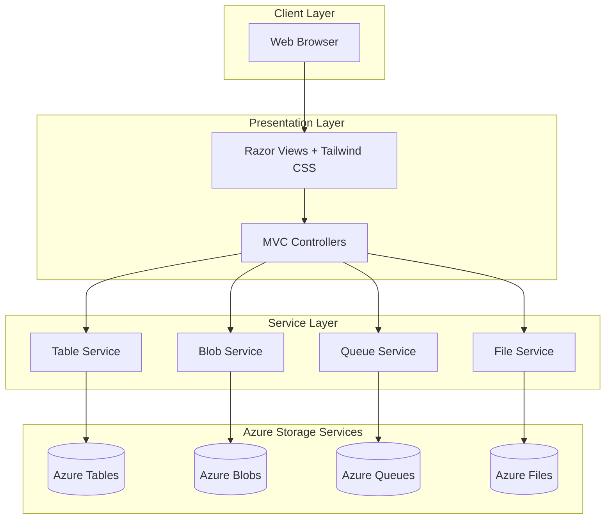
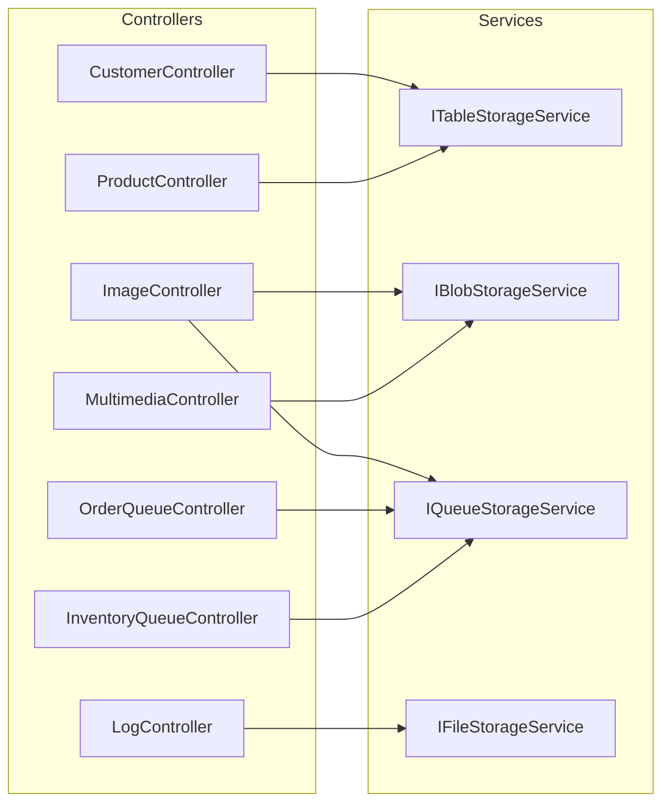

# Design Document: Azure Storage Retail Application

## Overview

This design document describes the architecture and implementation of an ASP.NET web application for ABC Retail that integrates with Azure Storage Services. The application replaces legacy on-premises infrastructure with cloud-native Azure services:

- **Azure Table Storage**: Stores customer profiles and product information (replacing relational database)
- **Azure Blob Storage**: Manages product images and multimedia content (replacing network shared drives)
- **Azure Queue Storage**: Handles order processing and inventory management messages (replacing legacy middleware)
- **Azure Files**: Centralizes application logging

The application is built with ASP.NET MVC using Tailwind CSS for styling, and is deployable to Azure App Service while supporting local development.

### Key Design Decisions

1. **Service Layer Pattern**: Each Azure Storage type has a dedicated service class implementing an interface for testability
2. **Configuration Abstraction**: Connection strings are managed through ASP.NET Core configuration, supporting both local and Azure environments
3. **Azure SDK Usage**: Uses official Azure.Data.Tables, Azure.Storage.Blobs, Azure.Storage.Queues, and Azure.Storage.Files.Shares NuGet packages
4. **MVC Architecture**: Standard ASP.NET Core MVC with Razor views and Tailwind CSS
5. **Dependency Injection**: All services registered in DI container for loose coupling

## Architecture

### High-Level Architecture Diagram



### Component Architecture



### Data Flow

1. **User Request**: Browser sends HTTP request to ASP.NET controller
2. **Controller Processing**: Controller validates input and calls appropriate service
3. **Service Execution**: Service interacts with Azure Storage SDK
4. **Response Generation**: Controller returns view with model data
5. **UI Rendering**: Razor view renders HTML with Tailwind CSS styling

## Components and Interfaces

### Service Interfaces

#### ITableStorageService

```csharp
public interface ITableStorageService
{
    // Customer Profile Operations
    Task<IEnumerable<CustomerProfile>> GetAllCustomersAsync();
    Task<CustomerProfile?> GetCustomerAsync(string partitionKey, string rowKey);
    Task CreateCustomerAsync(CustomerProfile customer);
    Task UpdateCustomerAsync(CustomerProfile customer);
    Task DeleteCustomerAsync(string partitionKey, string rowKey);
    
    // Product Operations
    Task<IEnumerable<Product>> GetAllProductsAsync();
    Task<Product?> GetProductAsync(string partitionKey, string rowKey);
    Task CreateProductAsync(Product product);
    Task UpdateProductAsync(Product product);
    Task DeleteProductAsync(string partitionKey, string rowKey);
}
```

#### IBlobStorageService

```csharp
public interface IBlobStorageService
{
    // Image Operations
    Task<string> UploadImageAsync(Stream fileStream, string fileName, string contentType);
    Task<IEnumerable<BlobItemInfo>> GetAllImagesAsync();
    Task<Stream> DownloadImageAsync(string blobName);
    Task DeleteImageAsync(string blobName);
    Task<string> GetImageUrlAsync(string blobName);
    
    // Multimedia Operations
    Task<string> UploadMultimediaAsync(Stream fileStream, string fileName, string contentType);
    Task<IEnumerable<BlobItemInfo>> GetAllMultimediaAsync();
    Task<Stream> DownloadMultimediaAsync(string blobName);
    Task DeleteMultimediaAsync(string blobName);
}
```

#### IQueueStorageService

```csharp
public interface IQueueStorageService
{
    // Order Queue Operations
    Task SendOrderMessageAsync(OrderMessage order);
    Task<IEnumerable<QueueMessageInfo>> PeekOrderMessagesAsync(int maxMessages = 32);
    Task<QueueMessageInfo?> DequeueOrderMessageAsync();
    Task<int> GetOrderQueueCountAsync();
    
    // Inventory Queue Operations
    Task SendInventoryMessageAsync(InventoryMessage inventory);
    Task<IEnumerable<QueueMessageInfo>> PeekInventoryMessagesAsync(int maxMessages = 32);
    Task<QueueMessageInfo?> DequeueInventoryMessageAsync();
    Task<int> GetInventoryQueueCountAsync();
    
    // Image Upload Notification Queue Operations
    Task SendImageUploadNotificationAsync(string imageName);
    Task<IEnumerable<QueueMessageInfo>> PeekImageNotificationsAsync(int maxMessages = 32);
}
```

#### IFileStorageService

```csharp
public interface IFileStorageService
{
    Task CreateLogFileAsync(string fileName, string content);
    Task<IEnumerable<LogFileInfo>> GetAllLogFilesAsync();
    Task<string> GetLogFileContentAsync(string fileName);
    Task<Stream> DownloadLogFileAsync(string fileName);
    Task DeleteLogFileAsync(string fileName);
    Task AppendToLogFileAsync(string fileName, string content);
}
```

### Controllers

| Controller | Responsibility | Primary Service |
|------------|---------------|-----------------|
| CustomerController | CRUD operations for customer profiles | ITableStorageService |
| ProductController | CRUD operations for products | ITableStorageService |
| ImageController | Upload, view, download, delete images | IBlobStorageService, IQueueStorageService |
| MultimediaController | Upload, view, download, delete multimedia | IBlobStorageService |
| OrderQueueController | Send/receive order messages | IQueueStorageService |
| InventoryQueueController | Send/receive inventory messages | IQueueStorageService |
| LogController | Create, view, download, delete log files | IFileStorageService |
| HomeController | Dashboard and navigation | None |

### View Models

```csharp
// Form view models for data binding
public class CustomerFormViewModel
{
    public string PartitionKey { get; set; }
    public string RowKey { get; set; }
    public string FirstName { get; set; }
    public string LastName { get; set; }
    public string Email { get; set; }
    public string PhoneNumber { get; set; }
    public string Address { get; set; }
}

public class ProductFormViewModel
{
    public string Category { get; set; }  // PartitionKey
    public string ProductId { get; set; } // RowKey
    public string ProductName { get; set; }
    public string Description { get; set; }
    public decimal Price { get; set; }
    public int StockQuantity { get; set; }
}

public class OrderFormViewModel
{
    public string OrderId { get; set; }
    public string CustomerId { get; set; }
    public string ProductId { get; set; }
    public int Quantity { get; set; }
    public string OrderStatus { get; set; }
}

public class InventoryFormViewModel
{
    public string ProductId { get; set; }
    public string ActionType { get; set; }  // Restock, Deduct, Alert
    public int Quantity { get; set; }
    public string Reason { get; set; }
}

public class LogFileFormViewModel
{
    public string FileName { get; set; }
    public string Content { get; set; }
}
```

## Data Models

### Azure Table Storage Entities

```csharp
public class CustomerProfile : ITableEntity
{
    public string PartitionKey { get; set; } = string.Empty;
    public string RowKey { get; set; } = string.Empty;
    public DateTimeOffset? Timestamp { get; set; }
    public ETag ETag { get; set; }
    
    // Business Properties
    public string FirstName { get; set; } = string.Empty;
    public string LastName { get; set; } = string.Empty;
    public string Email { get; set; } = string.Empty;
    public string PhoneNumber { get; set; } = string.Empty;
    public string Address { get; set; } = string.Empty;
}

public class Product : ITableEntity
{
    public string PartitionKey { get; set; } = string.Empty;  // Category
    public string RowKey { get; set; } = string.Empty;        // ProductId
    public DateTimeOffset? Timestamp { get; set; }
    public ETag ETag { get; set; }
    
    // Business Properties
    public string ProductName { get; set; } = string.Empty;
    public string Description { get; set; } = string.Empty;
    public double Price { get; set; }
    public int StockQuantity { get; set; }
}
```

### Blob Metadata Model

```csharp
public class BlobItemInfo
{
    public string BlobName { get; set; } = string.Empty;
    public string OriginalFileName { get; set; } = string.Empty;
    public string ContentType { get; set; } = string.Empty;
    public long Size { get; set; }
    public DateTimeOffset? UploadTimestamp { get; set; }
    public string Url { get; set; } = string.Empty;
}
```

### Queue Message Models

```csharp
public class OrderMessage
{
    public string OrderId { get; set; } = string.Empty;
    public string CustomerId { get; set; } = string.Empty;
    public string ProductId { get; set; } = string.Empty;
    public int Quantity { get; set; }
    public string OrderStatus { get; set; } = string.Empty;
    
    public string ToQueueMessage() => 
        $"Processing order {OrderId} for customer {CustomerId}: {Quantity} x {ProductId}";
}

public class InventoryMessage
{
    public string ProductId { get; set; } = string.Empty;
    public string ActionType { get; set; } = string.Empty;  // Restock, Deduct, Alert
    public int Quantity { get; set; }
    public string Reason { get; set; } = string.Empty;
    
    public string ToQueueMessage() => 
        $"{ActionType} inventory for {ProductId}: {Quantity} units - {Reason}";
}

public class QueueMessageInfo
{
    public string MessageId { get; set; } = string.Empty;
    public string Content { get; set; } = string.Empty;
    public DateTimeOffset? InsertedOn { get; set; }
    public DateTimeOffset? ExpiresOn { get; set; }
    public string PopReceipt { get; set; } = string.Empty;
}
```

### File Storage Model

```csharp
public class LogFileInfo
{
    public string FileName { get; set; } = string.Empty;
    public long Size { get; set; }
    public DateTimeOffset? LastModified { get; set; }
}
```

### Configuration Models

```csharp
public class AzureStorageSettings
{
    public string ConnectionString { get; set; } = string.Empty;
    public string TableConnectionString { get; set; } = string.Empty;
    public string BlobConnectionString { get; set; } = string.Empty;
    public string QueueConnectionString { get; set; } = string.Empty;
    public string FileConnectionString { get; set; } = string.Empty;
    
    // Container/Table/Queue/Share Names
    public string CustomerTableName { get; set; } = "customers";
    public string ProductTableName { get; set; } = "products";
    public string ImageContainerName { get; set; } = "images";
    public string MultimediaContainerName { get; set; } = "multimedia";
    public string OrderQueueName { get; set; } = "order-processing";
    public string InventoryQueueName { get; set; } = "inventory-management";
    public string ImageNotificationQueueName { get; set; } = "image-notifications";
    public string LogFileShareName { get; set; } = "logs";
}
```

### Validation Rules

| Entity | Field | Validation |
|--------|-------|------------|
| CustomerProfile | PartitionKey | Required, alphanumeric |
| CustomerProfile | RowKey | Required, alphanumeric |
| CustomerProfile | Email | Required, valid email format |
| CustomerProfile | FirstName | Required, max 100 chars |
| CustomerProfile | LastName | Required, max 100 chars |
| Product | PartitionKey (Category) | Required |
| Product | RowKey (ProductId) | Required |
| Product | Price | Required, >= 0 |
| Product | StockQuantity | Required, >= 0 |
| Image Upload | File Type | JPEG, PNG, GIF, WebP only |
| Image Upload | File Size | Max 10MB |
| Multimedia Upload | File Type | PDF, MP4, DOCX, XLSX only |
| Multimedia Upload | File Size | Max 100MB |


## Correctness Properties

*A property is a characteristic or behavior that should hold true across all valid executions of a system—essentially, a formal statement about what the system should do. Properties serve as the bridge between human-readable specifications and machine-verifiable correctness guarantees.*

### Property 1: Unique Blob Name Generation

*For any* image file uploaded to Azure Blob Storage, the generated blob name SHALL be unique and not conflict with any existing blob in the container, regardless of the original filename.

**Validates: Requirements 3.2**

### Property 2: Blob Metadata Preservation Round-Trip

*For any* file uploaded to Azure Blob Storage with metadata (original filename, upload timestamp, content type), retrieving the blob metadata SHALL return values matching the original metadata.

**Validates: Requirements 3.6**

### Property 3: Multimedia File Display Information

*For any* multimedia file stored in Azure Blob Storage, the rendered list entry SHALL include the blob name, file size, content type, and upload date.

**Validates: Requirements 4.3**

### Property 4: Queue Message Formatting

*For any* OrderMessage with fields (OrderId, CustomerId, ProductId, Quantity), the formatted queue message SHALL match the pattern: "Processing order {OrderId} for customer {CustomerId}: {Quantity} x {ProductId}".

*For any* InventoryMessage with fields (ProductId, ActionType, Quantity, Reason), the formatted queue message SHALL match the pattern: "{ActionType} inventory for {ProductId}: {Quantity} units - {Reason}".

*For any* image upload notification with imageName, the formatted message SHALL match the pattern: "Uploading an image {imageName} to blob storage".

**Validates: Requirements 5.2, 6.2, 7.1**

### Property 5: Log File Content Round-Trip

*For any* log file created with specified filename and content, retrieving the file content SHALL return the exact content that was written.

**Validates: Requirements 8.4**

### Property 6: Form Validation for Required Fields

*For any* form submission where one or more required fields are empty or contain only whitespace, the validation SHALL reject the submission and display specific error messages identifying which fields are invalid.

**Validates: Requirements 12.1, 12.2**

### Property 7: File Type Validation

*For any* file upload attempt:
- If the file extension is in the allowed set (images: .jpeg, .jpg, .png, .gif, .webp; multimedia: .pdf, .mp4, .docx, .xlsx), the validation SHALL accept the file.
- If the file extension is NOT in the allowed set, the validation SHALL reject the file with an appropriate error message.

**Validates: Requirements 12.3**

### Property 8: Error Logging Completeness

*For any* error that occurs during Azure Storage operations, the error SHALL be logged to Azure Files with sufficient detail for troubleshooting (timestamp, operation type, error message).

**Validates: Requirements 12.6**

## Error Handling

### Error Handling Strategy

The application implements a consistent error handling pattern across all Azure Storage operations:

```csharp
public class StorageOperationResult<T>
{
    public bool Success { get; set; }
    public T? Data { get; set; }
    public string? ErrorMessage { get; set; }
    public string? ErrorCode { get; set; }
}
```

### Error Categories

| Category | Azure Exception Type | User Message | Log Level |
|----------|---------------------|--------------|-----------|
| Connection Error | RequestFailedException (network) | "Unable to connect to storage service. Please try again later." | Error |
| Not Found | RequestFailedException (404) | "The requested item was not found." | Warning |
| Conflict | RequestFailedException (409) | "The item already exists or has been modified." | Warning |
| Authentication | RequestFailedException (401/403) | "Access denied. Please contact administrator." | Error |
| Validation Error | Custom ValidationException | Specific field validation message | Warning |
| File Too Large | Custom FileSizeException | "File exceeds maximum allowed size." | Warning |
| Invalid File Type | Custom FileTypeException | "File type not allowed." | Warning |
| Unknown | Exception | "An unexpected error occurred. Please try again." | Error |

### Service-Level Error Handling

Each service implements try-catch blocks around Azure SDK calls:

```csharp
public async Task<StorageOperationResult<CustomerProfile>> GetCustomerAsync(string partitionKey, string rowKey)
{
    try
    {
        var response = await _tableClient.GetEntityAsync<CustomerProfile>(partitionKey, rowKey);
        return new StorageOperationResult<CustomerProfile> 
        { 
            Success = true, 
            Data = response.Value 
        };
    }
    catch (RequestFailedException ex) when (ex.Status == 404)
    {
        return new StorageOperationResult<CustomerProfile> 
        { 
            Success = false, 
            ErrorMessage = "Customer not found.",
            ErrorCode = "NOT_FOUND"
        };
    }
    catch (RequestFailedException ex)
    {
        await _logService.LogErrorAsync($"Table operation failed: {ex.Message}");
        return new StorageOperationResult<CustomerProfile> 
        { 
            Success = false, 
            ErrorMessage = "Storage operation failed. Please try again.",
            ErrorCode = ex.ErrorCode
        };
    }
}
```

### Controller-Level Error Handling

Controllers translate service results to appropriate views:

```csharp
public async Task<IActionResult> Details(string partitionKey, string rowKey)
{
    var result = await _tableService.GetCustomerAsync(partitionKey, rowKey);
    
    if (!result.Success)
    {
        TempData["Error"] = result.ErrorMessage;
        return RedirectToAction(nameof(Index));
    }
    
    return View(result.Data);
}
```

### Global Exception Handler

A middleware component catches unhandled exceptions:

```csharp
public class GlobalExceptionMiddleware
{
    public async Task InvokeAsync(HttpContext context)
    {
        try
        {
            await _next(context);
        }
        catch (Exception ex)
        {
            await _logService.LogErrorAsync($"Unhandled exception: {ex}");
            context.Response.StatusCode = 500;
            await context.Response.WriteAsync("An unexpected error occurred.");
        }
    }
}
```

## Testing Strategy

### Testing Approach

The application uses a dual testing strategy:
1. **Property-Based Tests**: Verify universal properties across many generated inputs
2. **Unit Tests**: Verify specific examples, edge cases, and integration points
3. **Integration Tests**: Verify Azure Storage service interactions

### Test Framework and Libraries

- **xUnit**: Primary test framework
- **FsCheck** or **FsCheck.Xunit**: Property-based testing library for .NET
- **Moq**: Mocking framework for unit tests
- **FluentAssertions**: Assertion library for readable tests

### Property-Based Tests

Each correctness property will be implemented as a property-based test with minimum 100 iterations:

```csharp
[Property(Arbitrary = new[] { typeof(OrderMessageArbitrary) })]
// Feature: azure-storage-retail-app, Property 4: Queue Message Formatting
public Property OrderMessage_FormatsCorrectly(OrderMessage order)
{
    var formatted = order.ToQueueMessage();
    var expected = $"Processing order {order.OrderId} for customer {order.CustomerId}: {order.Quantity} x {order.ProductId}";
    return (formatted == expected).ToProperty();
}
```

### Unit Test Coverage

| Component | Test Focus |
|-----------|------------|
| TableStorageService | CRUD operations with mocked TableClient |
| BlobStorageService | Upload/download with mocked BlobContainerClient |
| QueueStorageService | Send/receive with mocked QueueClient |
| FileStorageService | File operations with mocked ShareClient |
| Controllers | Action methods with mocked services |
| View Models | Validation attribute behavior |

### Integration Tests

Integration tests verify actual Azure Storage connectivity using Azurite (local Azure Storage emulator) or test Azure Storage accounts:

```csharp
public class TableStorageIntegrationTests : IClassFixture<AzuriteFixture>
{
    [Fact]
    public async Task CreateCustomer_InsertsEntity_Successfully()
    {
        // Arrange
        var service = new TableStorageService(_testConnectionString);
        var customer = new CustomerProfile { /* test data */ };
        
        // Act
        await service.CreateCustomerAsync(customer);
        var retrieved = await service.GetCustomerAsync(customer.PartitionKey, customer.RowKey);
        
        // Assert
        retrieved.Should().BeEquivalentTo(customer);
    }
}
```

### Test Data Generators

Custom FsCheck generators for domain objects:

```csharp
public static class Generators
{
    public static Arbitrary<CustomerProfile> CustomerProfileArbitrary =>
        (from partitionKey in Arb.Generate<NonEmptyString>()
         from rowKey in Arb.Generate<NonEmptyString>()
         from firstName in Arb.Generate<NonEmptyString>()
         from lastName in Arb.Generate<NonEmptyString>()
         from email in Gen.Elements("test@example.com", "user@domain.org")
         select new CustomerProfile
         {
             PartitionKey = partitionKey.Get,
             RowKey = rowKey.Get,
             FirstName = firstName.Get,
             LastName = lastName.Get,
             Email = email
         }).ToArbitrary();
}
```

### Test Configuration

Property-based tests are configured with:
- **MinTests**: 100 (minimum iterations per property)
- **MaxTests**: 500 (maximum iterations)
- **Replay**: Seed values recorded for reproducibility

```csharp
[Property(MaxTest = 100, Verbose = true)]
// Feature: azure-storage-retail-app, Property 7: File Type Validation
public Property FileTypeValidation_AcceptsValidTypes(ValidImageExtension ext)
{
    var result = FileValidator.IsValidImageType($"test.{ext}");
    return result.ToProperty();
}
```
